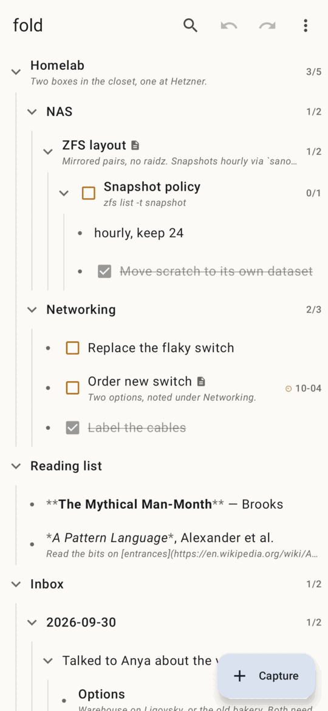
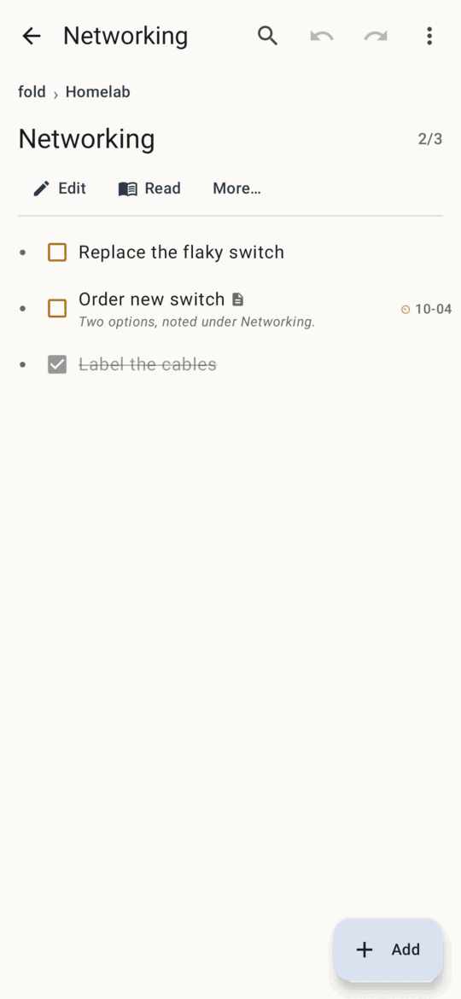
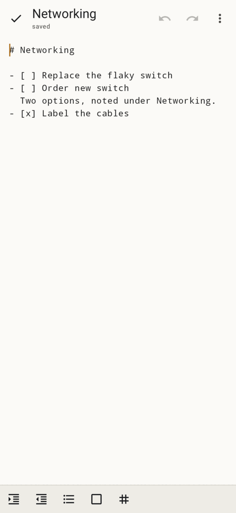
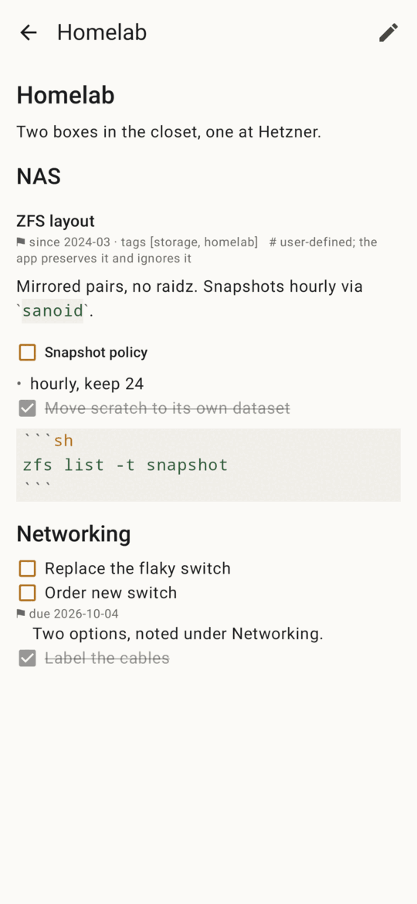

# fold for Android

The same outline on your phone: fold for Android opens the vault the desktop app
uses — `root.md` and its block files, synced by Syncthing — and reads and writes
it with the same code. Every file it writes comes out of `fold-core`, the crate
the TUI and the CLI use, so a vault edited on the phone is byte for byte what
the desktop would have written.

<p>




</p>

## What it does

- **The outline**: every node a row, folds, `☐`/`☑` to check a task off,
  open/total task counts, due dates, a `▤` for nodes with their own file, the
  first line of each node's text under its title. Tap a row to zoom into it;
  the breadcrumb and Back zoom out. Folds, zoom and "hide done" are remembered
  per vault on the phone, never in the vault.
- **Long-press a row** (or *More…*) for everything you can do to a node — the
  TUI's node menu: edit, zoom, properties, new sibling or child, done/reopen,
  task on/off, heading ↔ bullet, give it its own file, move up/down,
  indent/outdent, move to…, archive, copy, paste, delete, resolve conflict.
- **Capture** drops a note (or a task) under today's day in the Inbox, as
  `fold capture` does. Share text from any app to fold, or long-press the
  launcher icon for *Capture*.
- **Edit** a node: its subtree's Markdown in a plain text box, every nested
  block inlined, as the TUI's editor shows it. Each line still belongs to its
  block, so each save writes each block to its own file; it saves when you
  pause and when you leave. A bar above the keyboard indents, outdents, and
  toggles bullets, checkboxes and headings.
- **Read** a node as a document, with light Markdown styling, checkboxes you
  can tick and links you can open.
- **Find** titles and text; **Move to…** picks a destination from a list.
- **Properties** in a form — a due date with a date picker; the first one
  gives the node its own file, as on the desktop.
- **Undo and redo** every change, from the top bar or the message after it.
  Undo refuses, writing nothing, when the file changed since (a sync).
- **Sync**: fold watches the vault folder, takes in what Syncthing brings, and
  says what changed (*↻ changed outside fold: Inbox (+1 item)*). Sync-conflict
  copies are merged node by node, and pairs it cannot merge are shown side by
  side to keep ours, theirs or both.
- **Check the vault** (`fold check`), *Canonicalize* (`fold check --fix`), and
  the trash, with restore.

## Install

Build it (below), then install `app/build/outputs/apk/debug/app-debug.apk` on
the phone — `adb install`, or copy the file over and open it.

On first start, choose the folder Syncthing syncs your vault to (or keep a
vault on the phone only). fold reads and writes the vault's files in place, as
Syncthing itself does, so for a folder in shared storage it asks for
**all files access** (Android 11+; on Android 8–10, storage permission). It
writes nothing outside the vault but its own trash, which lives in the app's
private storage. That permission is why this is a build-it-yourself app and not
a Play Store one.

An empty folder becomes a new vault with an Inbox. As on the desktop, give
Syncthing a `.stignore` with `*.fold-tmp` and `*.tmp`.

## Build

You need:

- the Android SDK with platform 37 and NDK 28.2.13676358 (Android Studio
  installs both; or `sdkmanager "platforms;android-37.0" "ndk;28.2.13676358"`),
- a recent stable Rust with the Android targets and
  [cargo-ndk](https://github.com/bbqsrc/cargo-ndk):

  ```sh
  rustup target add aarch64-linux-android armv7-linux-androideabi x86_64-linux-android
  cargo install cargo-ndk
  ```

- JDK 17 or newer.

Then, from `android/`:

```sh
./gradlew assembleDebug        # app/build/outputs/apk/debug/app-debug.apk
./gradlew installDebug         # onto a connected phone
./gradlew assembleRelease      # shrunk; sign it with your own key
```

Gradle builds the Rust core itself: `cargoNdk` compiles `crates/fold-ffi` for
the ABIs in `gradle.properties` (`fold.abis`; drop `armeabi-v7a` or `x86_64`
to build faster), and `uniffiBindgen` builds it for this machine and generates
its Kotlin bindings. Opening `android/` in Android Studio works the same way.

## How it fits together

```
crates/fold-core     the vault: parse, render, splice, every verb, merge
crates/fold-ffi      a Session over fold-core for other languages (UniFFI):
                     outline rows, reading lines, verbs with an op log,
                     the editor's tagged lines, sync and conflicts
android/app          Jetpack Compose UI; calls the Session on one worker
                     thread through the generated Kotlin bindings
```

`fold-ffi` holds what the TUI holds between keys — the undo log, the register,
the open editor — and follows the TUI's rules for them: verbs refuse to write
over a file changed on disk, an editor save is one undo step, a block cut in
the editor and pasted elsewhere moves with its file. Nodes are named by keys
([SPEC.md](../SPEC.md) §3.4), so a tap never acts on a node that moved under it.

The editor is the one place the phone differs in kind: a text field reports
its whole text after each change, so `fold-ffi` finds the span that changed and
replays it through the same line rules as the TUI's editor, using the caret to
tell, say, Enter at the end of one line from Enter at the start of the next.

## Tests

```sh
cargo test -p fold-ffi             # the session, the editor bridge (Rust)
./gradlew testDebugUnitTest        # the Kotlin bindings over the host build of
                                   # the core, and the UI under Robolectric
./gradlew recordRoborazziDebug     # the same, saving a screenshot of each screen
                                   # to app/build/outputs/roborazzi
```

Robolectric downloads an Android framework jar on first use. Offline, or behind
a rate-limited mirror, put
`android-all-instrumented-15-robolectric-13954326-i7.jar` in a folder and pass
`-Probolectric.dependency.dir=/that/folder`.

## Not there yet

- No drag and drop: rows move with Move up/down, Indent/Outdent and Move to….
- No syntax highlighting in fenced code; it is shown in a monospace block.
- The editor has no Vim or Helix keys; it is the phone's keyboard.
